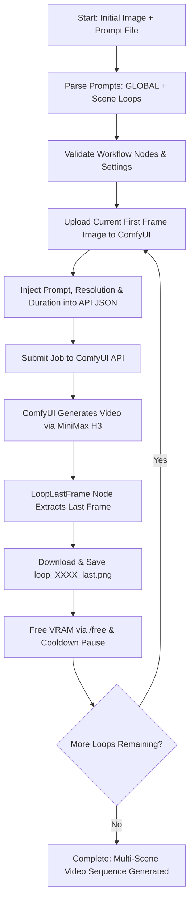

# ComfyUI MiniMax Hailuo H3 Custom Loop Controller

[](https://github.com/comfyanonymous/ComfyUI)
[](https://www.python.org/)
[](https://hailuoai.video/)

An automated continuous video generation pipeline for **ComfyUI** using the **MiniMax Hailuo H3 (Image-to-Video)** model. This tool enables seamless multi-scene narrative generation by automatically using the **last frame of the previous generated video** as the **first frame (starting image) for the next scene**.

---

## 🌟 Key Features

- 🔄 **Continuous Frame-to-Frame Looping**: Automatically extracts the final frame of each scene to seed the next video clip, ensuring smooth visual transitions across multi-segment animations.
- 🎭 **Global & Per-Scene Prompting**: Enforces consistent character identity, environment details, and art style across all scenes using a `GLOBAL:` prompt header paired with per-scene `---LOOP---` prompt sections.
- 🎛️ **Dynamic Resolution & Duration Control**: Dynamically override video dimensions (`--width`, `--height`) and clip length (`--duration`) directly from the command line without editing workflow JSON files.
- ⏯️ **Resume Capability**: Mid-run interruption recovery allows resuming from any loop index (`--start-loop N`) using a saved frame checkpoint (e.g., `loop_0003_last.png`).
- 🛡️ **Automated VRAM & Thermal Safety**: Monitors VRAM/RAM consumption and GPU temperatures between loops, triggers ComfyUI model unloading (`/free` endpoint), and executes customizable cooldown pauses (`--pause`).
- 🧩 **Custom ComfyUI Node**: Includes `LoopLastFrame`, a lightweight custom node that extracts the last frame tensor from a video frame batch inside ComfyUI.

---

## 📁 Repository Structure

```text
workflow_minimax_con_custom_loop/
├── __init__.py                    # Custom ComfyUI node: LoopLastFrame
├── loop.py                        # Main automation script 
├── MiniMax_H3_Loop_API.json       # Pre-configured ComfyUI API workflow
├── prompts.txt                    # Example multi-scene prompt file 
└── initial.jpg                    # Sample starting frame image
```

---

## ⚙️ Installation & Setup

### 1. Install the `LoopLastFrame` Custom Node
Copy `__init__.py` from this repository into your ComfyUI `custom_nodes` directory:

```text
ComfyUI/
└── custom_nodes/
    └── LoopLastFrame/
        └── __init__.py
```

*Note: Restart ComfyUI after adding the custom node.*

### 2. Install Python Dependencies
The controller script requires Python 3.10+ and standard HTTP/system libraries along with `requests`:

```bash
pip install requests
```

### 3. Launch ComfyUI
Start ComfyUI with the API server enabled (default port `8188`):

```bash
python main.py --listen 127.0.0.1 --port 8188
```

---

## 📝 Prompt Formatting (`prompts.txt`)

Prompts are structured into a **GLOBAL** style prefix and individual **LOOP** scenes divided by `---LOOP---` or `===LOOP===`.

### Format Specification
- **`GLOBAL:`** (Optional): Text at the start of the file applied to **every** scene loop. Ideal for character appearance, camera style, lighting, and environmental consistency.
- **`---LOOP---` or `===LOOP===`**: Separates consecutive scene prompts.

### Example Prompt File (`prompts.txt`)

```text
GLOBAL:
Same character identity, same face, same hair, same clothing and same environment geometry throughout the entire sequence. Cinematic photorealistic style.

Close-up on Link, wearing his classic tunic, standing inside an ancient stone temple illuminated by soft blue light. Link slowly walks toward Zelda, who is standing beside an ancient glowing altar. She looks at him with concern and says: "Link... you finally came."

---LOOP---

Medium close-up on Zelda and Link inside the ancient temple, keeping both characters' faces and clothing perfectly consistent. Zelda steps closer to Link and holds out a glowing golden fragment of the Triforce. She looks directly at him and says: "Ganondorf has returned."

---LOOP---

Wide cinematic shot of Link and Zelda running through an ancient forest at night, maintaining previous character appearance. Link runs slightly ahead while Zelda follows closely behind. Zelda looks back in fear and says: "Link, they're coming!"
```

When executed, `loop_v14.py` merges `GLOBAL` + `Scene Prompt` for each iteration.

---

## 🚀 Usage Guide

### Basic Command
Run the automation loop starting with an initial seed image (`initial.jpg`):

```bash
python loop.py \
  --workflow MiniMax_H3_Loop_API.json \
  --prompt prompts.txt \
  --image initial.jpg
```

### Specifying Loop Count & Video Parameters
Override video resolution (`864x480`), clip duration (`5s`), and limit the execution to 8 loops:

```bash
python loop.py \
  --workflow MiniMax_H3_Loop_API.json \
  --prompt prompts.txt \
  --image initial.jpg \
  --loops 8 \
  --width 864 \
  --height 480 \
  --duration 5
```

### Resuming from an Intermediate Loop
If generation was stopped or you want to branch from loop 4, pass the last saved frame of loop 3 (`loop_0003_last.png`) and set `--start-loop 4`:

```bash
python loop.py \
  --workflow MiniMax_H3_Loop_API.json \
  --prompt prompts.txt \
  --image h3_loop_output/loop_0003_last.png \
  --start-loop 4 \
  --pause 30
```

### Dry-Run Workflow Verification
Verify that the workflow JSON contains all required node mappings without initiating video generation:

```bash
python loop.py --workflow MiniMax_H3_Loop_API.json --prompt prompts.txt --image initial.jpg --check
```

---

## 🎛️ Command-Line Arguments Reference

| Argument | Type | Default | Description |
| :--- | :--- | :--- | :--- |
| `--workflow` | `str` | *Required* | Path to ComfyUI API workflow JSON (`MiniMax_H3_Loop_API.json`). |
| `--prompt` | `str` | *Required* | Path to prompt text file containing `GLOBAL:` and `---LOOP---` splitters. |
| `--image` | `str` | *Required* | Path to initial image used as the first frame for the starting loop. |
| `--base-url` | `str` | `http://127.0.0.1:8188` | Base URL of the running ComfyUI API server. |
| `--loops` | `int` | `0` | Number of loops to process (`0` processes all remaining prompts). |
| `--start-loop` | `int` | `1` | 1-based prompt index to start from. |
| `--width` | `int` | `None` | Override output video width in pixels (must be divisible by 32). |
| `--height` | `int` | `None` | Override output video height in pixels (must be divisible by 32). |
| `--duration` | `float` | `None` | Override video duration in seconds. |
| `--outdir` | `str` | `h3_loop_output` | Output directory path for frame images and logs. |
| `--pause` | `int` | `30` | Cooldown period (in seconds) between loops after VRAM/RAM cleanup. |
| `--check` | `flag` | `False` | Perform workflow structural validation check and exit. |

---

## 🏗️ How It Works (Architecture Flow)



---

## 🧹 VRAM & Resource Management

Generating high-resolution videos sequentially can accumulate VRAM usage and overheat GPUs during multi-hour jobs. `loop_v14.py` implements proactive resource safety:

1. **Automatic Memory Release**: Calls ComfyUI's `/free` endpoint between loops to unload cached models from VRAM.
2. **System Health Checks**: Monitors system RAM, GPU VRAM, and GPU temperature before initializing the next scene.
3. **Smart Cooldown**: Pauses execution (`--pause`) to allow hardware thermals to settle between intensive video diffusion passes.

---

## ❓ Troubleshooting

<details>
<summary><b>Error: Node 15 (MiniMaxH3ImageToVideo) was not found</b></summary>

Ensure you have installed the MiniMax H3 extension in your ComfyUI instance and that custom nodes loaded successfully during ComfyUI startup.
</details>

<details>
<summary><b>Error: Node 92 (LoopLastFrame) not found</b></summary>

Copy `__init__.py` into `ComfyUI/custom_nodes/LoopLastFrame/__init__.py` and restart ComfyUI.
</details>

<details>
<summary><b>Workflow JSON format error</b></summary>

Make sure to export your workflow from ComfyUI using **Save (API Format)**. Standard Web UI workflow JSON files are not formatted for direct API execution.
</details>

---

## 📜 License

This project is open-source and available under the MIT License.
